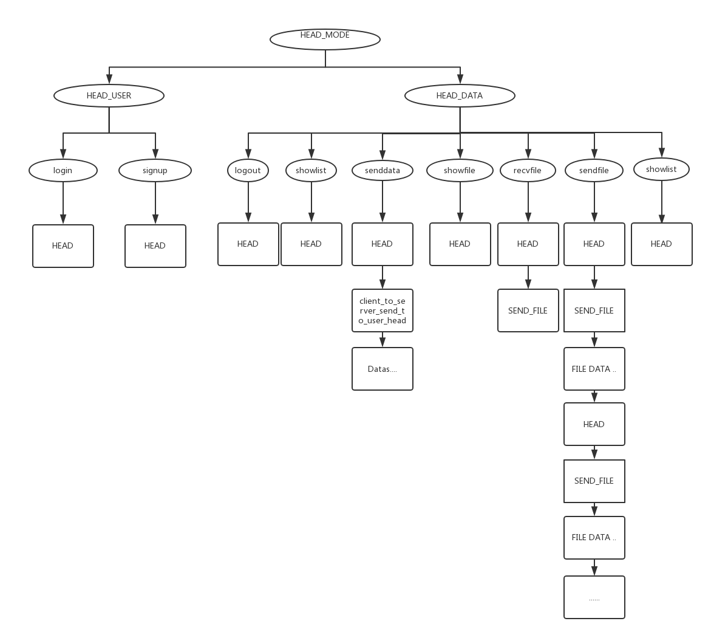
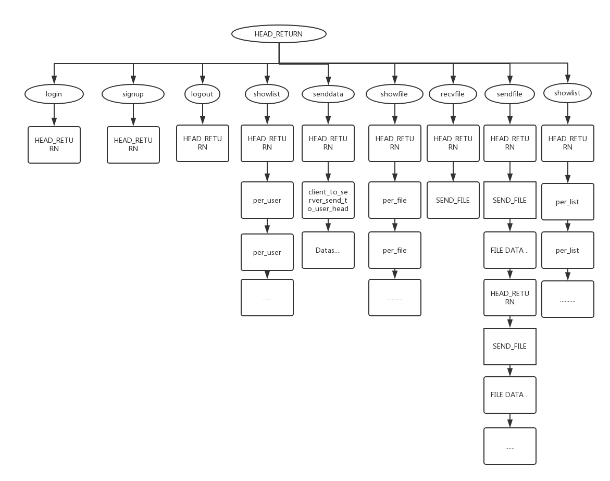

# 结构图

## 客户端到服务器



## 服务器到客户端



## 数据报头

### 客户端到服务器

| HEAD_MAIN | HEAD_USER                                |
| --------- | ---------------------------------------- |
| char mode | char logmode; char username[16];char password[16];char nickname[16]; |
| 1         | 49                                       |

|  discript  | HEAD_MAIN mode | HEAD_USER logmode | char username | char password | char nickname |
| :--------: | -------------- | ----------------- | ------------- | ------------- | ------------- |
| login（登录）  | 0              | 1                 | `username`    | `password`    | []            |
| signup（注册） | 0              | 0                 | `username`    | `password`    | `nickname`    |

| HEAD_MAIN | HEAD_DATA                                |
| --------- | ---------------------------------------- |
| char mode | char token[44];char datamode;int datalen; |
| 1         | 49                                       |

| discript                | HEAD_MAIN mode | token   | HEAD_DATA datamode | int datalen |
| ----------------------- | -------------- | ------- | ------------------ | ----------- |
| logout（登出）              | 0              | `token` | 0                  | 0           |
| senddata（向某一用户发送消息）     | 0              | `token` | 1                  | `len`       |
| sendfile（客户端向服务器发送文件）   | 0              | `token` | 10                 | `len`       |
| recvfile（客户端接收服务器存储的文件） | 0              | `token` | 20                 | `len`       |
| showfile（服务器文件列表）       | 0              | `token` | 3                  | 0           |
| showlist（显示在线用户）        | 0              | `token` | 2                  | 0           |

#### 客户端到服务器附加数据

- senddata（向某一用户发送消息）

`struct client_to_server_send_to_user_head`

```c
struct client_to_server_send_to_user_head{
	char username[16];
	int len;
};
```

| discript       | 结构体属性    | 大小   |
| -------------- | -------- | ---- |
| direction user | username | 16   |
| data len       | len      | int  |
| data           | ???      | ???  |

- sendfile（客户端向服务器发送文件）
  `struct SEND_FILE`

  ```c
  struct SEND_FILE{
  	char filename[32];
  	unsigned int id;
  	unsigned int perlength;
  	unsigned long filelength;
  };
  ```

| discript | 结构体属性      | 大小            |
| -------- | ---------- | ------------- |
| 文件名      | filename   | 32            |
| 文件分块ID   | id         | unsigned int  |
| 文件分块大小   | perlength  | unsigned int  |
| 发送文件总大小  | filelength | unsigned long |

### 服务器到客户端

`struct HEAD_RETURN`

```c
struct HEAD_RETURN{
	char mode;
	char succ;//是否成功
	unsigned int datalen;
}HEAD_RETURN;
```

| discript                             | mode | succ   | datalen |
| ------------------------------------ | ---- | ------ | ------- |
| login（登录）                            | 11   | 0 or 1 | `len`   |
| signup（注册）                           | 12   | 0 or 1 | 0       |
| another user login（登录的用户被其他人登录，自动下线） | 13   | 0 or 1 | 0       |
| logout（登出）                           | 21   | 0 or 1 | 0       |
| showlist（显示在线用户列表）                   | 22   | 0 or 1 | `len`   |
| showfile（显示服务器文件列表）                  | 23   | 0 or 1 | `len`   |
| senddata（自己的消息是否成功）                  | 20   | 0 or 1 | 0       |
| receive data（其他人发送来的消息）              | 99   | 0      | `len`   |
| recv sendfile(服务器接收到文件)              | 35   | 0 or 1 | `len`   |
| sendto user sendfile（服务器向客户端发送文件）    | 30   | 0 or 1 | `len`   |
| token error（用户登录异常）                  | 50   | 1      | 0       |

**succ==0 successful; succ!=0 unsuccessful（0为成功）**

#### 服务器返回附加数据

- server_login_return（登录成功返回附加数据）

```c
struct server_login_return{
    char nickname[16];
    char token[32];
}server_login_return;
```

| discript  | 结构体属性    | 大小   |
| --------- | -------- | ---- |
| 登录用户的昵称   | nickname | 16   |
| 标识用户身份的令牌 | token    | 32   |

- list_per_user（显示已登录用户  返回附加数据）

```c
struct list_per_user{
	char username[16];
	char nickname[16];
}list_per_user;
```

| discript    | 结构体属性    | 大小   |
| ----------- | -------- | ---- |
| 第一个登录用户的用户名 | username | 16   |
| 第一个用户的昵称    | nickname | 16   |
| 第二个登录用户的用户名 | username | 16   |
| 第二个用户的昵称    | nickname | 16   |
| ...         | ...      | 16   |

**HEAD_RETURN的datalen为     登录用户数量\*sizeof(list_per_user)**


- showfile（显示服务器文件列表）

```c
struct list_per_file{
	char filename[32];
	unsigned long size;
};
```

返回n个`list_per_file`结构体，根据`HEAD_RETURN`中`datalen`判断n的大小。

**datalen = n\*sizeof(list_per_user)**

| discript | 结构体属性    | 大小   |
| -------- | -------- | ---- |
| 文件名      | filename | 32   |
| 文件大小     | size     | 8    |

- receive data（其他人发送来的消息）

```c
struct server_to_client_send_to_user_head{
	char username[16];
	int len;
};
```
| discript | 结构体属性    | 大小   |
| -------- | -------- | ---- |
| 发送者用户名   | username | 16   |
| 数据长度     | len      | 4    |
| 用户发送数据   | ???      | ???  |


- recv sendfile(服务器接收到文件)

```c
struct SEND_FILE{
	char filename[32];
	unsigned int id;
	unsigned int perlength;
	unsigned long filelength;
};
```
| discript | 结构体属性      | 大小   |
| -------- | ---------- | ---- |
| 文件名      | filename   | 32   |
| 分块id     | id         | 4    |
| 块数据大小    | perlength  | 4    |
| 文件总大小    | filelength | 8    |
| 文件块数据    | ???        | ???  |

- sendto user sendfile（服务器向客户端发送文件）

```c
struct SEND_FILE{
	char filename[32];
	unsigned int id;
	unsigned int perlength;
	unsigned long filelength;
};
```
| discript | 结构体属性      | 大小   |
| -------- | ---------- | ---- |
| 文件名      | filename   | 32   |
| 分块id     | id         | 4    |
| 块数据大小    | perlength  | 4    |
| 文件总大小    | filelength | 8    |
| 文件块数据    | ???        | ???  |

**注：文件分块大小不能改变**


# 函数说明
## 头
- my.h

```c
#define DEBUG true//是否debug（目前这一定义没用。。）

#define PERSTRLENGTH 200 //分割字符串的最大长度
#define TOKENSIZE 32//token大小

#define FILEPERLEN 1024//文件传输，分块大小
#define SAVEFILEPATH "data"//服务器文件保存目录
#define CLIENTDATAPATH "clientdata"//客户端文件保存目录

#define MAX_EVENTS 100 // 服务器每次循环event上限
#define DATABASENAME "data.sqlite3"//数据库服务器保存位置
```
## 其他

- client_recv.c

```c
struct HEAD_RETURN* client_recv_HEAD_RETURN(int sockfd);
struct server_login_return* client_recv_login_return(int sockfd);
struct server_to_client_send_to_user_head* client_recv_data_return(int sockfd);
struct list_per_user* client_recv_list_return(int sockfd);


int client_recv(int sockfd, char** nickname,char** token);

void message_out(char* data);
void message_out_login_peruser(char* username,char* nickname);

void client_recv_and_out_perlist(int sockfd);
void client_recv_and_out_data(int sockfd);
void message_out_recv_data(char* username,char* data,int len);
```

- mysocket.c

```c
  int Socket(int domain, int type, int protocol);
  int Bind(int sockfd,struct sockaddr* addr,socklen_t size);
  int Listen(int sockfd,int backlog);
  int Accept(int sockfd,struct sockaddr* addr,socklen_t* size);
  int Connect(int sockfd,struct sockaddr* addr,int size);

  ssize_t Send(int sockfd, const void *buf, size_t len, int flags);
  ssize_t Recv(int sockfd, void *buf, size_t len, int flags);

  int CreateClient(char* serverip,int port);
  int CreateServer(int port,int backlog);
```

- mystruct.c

```c
struct HEAD_USER_ALL* data_login(char* username,char* password);
struct HEAD_USER_ALL* data_signup(char* username,char* password,char* nickname);

struct HEAD_DATA* data_HEAD_DATA(char* token, int mode,int len);
struct HEAD_DATA* data_logout(char* token);
struct HEAD_DATA* data_showlist(char* token);
struct HEAD_DATA* data_sendto(char* token);
struct HEAD_DATA* data_showfile(char* token);
struct HEAD_DATA* data_sendfile(char* token);

struct HEAD_RETURN* data_head_return(char mode,char succ,unsigned int datalen);
```


- mystring.c

```c
#define PERSTRLENGTH 200 //分割字符串的最大长度

char** split(char* str); // 分割字符串为2段
char** split_num(char* str,int num);//分割字符串为num段
void free_splitdata(char** data);// 释放分割字符串空间
void free_splitdata_num(char** data,int num);// 释放分割字符串空间

char* itoa(int num);
char* ltoa(long num);
char* ptoa(void* num);
```
**可以使用`make test_mysring`测试**

- filetransport.c

```c
struct SEND_FILE* recv_sendfile_head(int sockfd);
void mergeFiles(char* filename, unsigned int maxid, unsigned int perlength, unsigned long filelength);
struct SEND_FILE* sendfile_head(char* filename, unsigned int id, unsigned int datalen, unsigned long filelength);
void client_sendfile(int sockfd,char* token,char* path,char* filename);
int trave_dir(char* path, struct file_list** data);
void client_startrecv_id(int sockfd,char* token, char* filename,int id,long filelength);
void client_recvfile(int sockfd,char* path,char* token);

```


- encode.c
```c
char* createToken(int len); // 创建长度len-1的随机字符串（最后一位是'\0'）[需要手工free]
void print16(char* data,int size);// 每个字节以16进制输出
void printAscii(char* data,int size);
char* encodePassword(char* password); // TODO
```

- sql.c
```c
int Sqlite3_open(char* name,sqlite3** db);// open database
sqlite3* createDatabase(sqlite3* db);// create new database
sqlite3* databaseInit();//auto open or create database
int sql_createUser(sqlite3* db,char* username,char* password,char* nickname);
int sql_login(sqlite3* db,char* username,char* password,char** gettingnick);
int sql_changeNickname(sqlite3* db,char* username,char* newnickname);
int sql_all(sqlite3* db,char*** data,int* row,int* col);
// sql_all(db,NULL,NULL,NULL); auto printf database data;
/*
	-   sql_all(db,NULL,NULL,NULL);

	-   char** data;
		int row,col;
		sql_all(db,&data,&row,&col);
*/
```