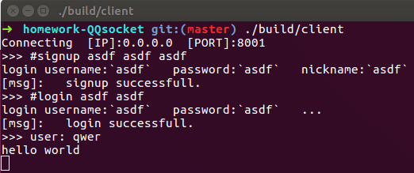
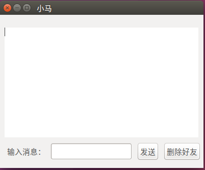

# 项目设计报告书

## 一、项目题目及功能

**项目题目**：设计一个类似于QQ或MSN的聊天系统。

**项目功能**：

1.  新用户注册；
2.  用户登录和退出；
3.  聊天服务；
4.  在线用户查询；
5.  文件传送服务；
6.  文件断点续传。

## 二、项目组人员及任务分工

**王炳荃** ：UI界面设计与开发

**韩慧** ：文档撰写与设计

**李春洋** ：服务器搭建及命令行模式客户端开发

## 三、项目整体设计框架图及说明

### 概述

**运行环境搭建** ：采用64位Linux操作系统。推荐使用ubuntu16.04 x64。调用了`glib`和`sqlite3`, 编译运行需安装好`glib`与`sqlite`的开发库（详细安装过程见 **七** ）。

**数据库创建：** 数据库主要用于记录注册人员信息。

基于以上两个条件，程序才可运行。客户端登录时先判断是否已**注册** ，若用户已注册，直接输入账号和密码点击登录即可；若未注册，则需点击注册进入注册界面，输入用户名、密码和确认密码；无操作需求则点击退出。

用户**登录** 时，服务器会随机分配一个**token** 标识，进入QQ界面后，好友**列表** 显示在线用户，选择某一在线用户，即可与其进行聊天和**文件传输** 。

文件传输时，划分文件区块，每次传输信息前附加文件区块信息，实现文件的 **断点续传** 功能。

_由于程序编写与设计时，两人分工不同，沟通不畅通，导致UI没有完全实现服务器功能。且在服务器调试过程中，需要有客户端调试。因此最终产生了两种客户端，一为命令行界面，一为UI界面。_ 

### 服务器设计

服务器采用**epoll**方法，单进程单线程**多路复用**方式进行**TCP**的传输。整个服务器运行期间存有以下几个哈希表

<table>
<thead>
<tr><th>键</th><th>值</th></tr></thead>
<tbody><tr><td>用户名</td><td>sockfd</td></tr><tr><td>token</td><td>用户名</td></tr><tr><td>用户名</td><td>昵称</td></tr><tr><td>sockfd</td><td>event</td></tr><tr><td>sockfd</td><td>senddata</td></tr></tbody>
</table>

| 键      | 值        |
| ------ | -------- |
| 用户名    | sockfd   |
| token  | 用户名      |
| 用户名    | 昵称       |
| sockfd | event    |
| sockfd | senddata |

采用**哈希表**保存临时数据，实现了数据的快速查找。

当收到用户信息时，服务器处理用户信息，并调用`SendToFd`函数，将要发送的数据放到`sock2data`指向的链表中。

第二次epoll时，从链表中循环读取要发送的数据，发送数据并释放数据占用的内存。

### 命令行式客户端设计

采用**多进程** 模式。两个进程：

*   从键盘读取数据，解析用户命令，并向服务器发送数据
*   从服务器接收消息，解析数据包，并显示给用户

两个进程之间采用**共享内存** 的方式进行数据的传输，共享的数据有用户登录的token，用户名，用户昵称等信息。

### UI客户端设计

采用**gtk框架**，实现可视化的UI设计。UI采用**多线程** 模式，副线程从服务器接收信息，主线程向服务器发送信息。副线程接收到消息后，采用信号量等方式将数据传输到主线程，并由主线程进行信息的最终绘制过程。

## 四、项目分模块设计说明、流程图

### 命令行下客户端具有的功能与相应命令

*   **通用模块**

`#help` //显示帮助
`#status` //显示客户端目前状态（是否在线，如果在线的话显示用户名）
`#exit`// 退出程序，正常登出

*   **用户管理模块**

`#signup [username] [password] [nickname]`//注册用户
`#login [username] [password]` //登录用户
`#logout`  //退出登录

`#showlist` //显示所有已登录用户

*   **信息交流模块**

`#sendto [sendto_username] [data]` //向某一用户发送信息

// sendto_username: 要发送的目标用户名,
// data: 发送的数据

*   **文件传输模块**

`#showfiles` //显示服务器已存在的文件
`#sendfile [filename] [dstfilename]`//向服务器发送文件

//filename： 要发送的文件名
//dstfilename： 服务器端保存的文件名
`#recvfile [filename] [id=0]`// 从服务器下载文件
//filename 服务器的文件名
//id 断点续传的文件块，默认为0

## 五、项目关键数据结构及说明

### 客户端到服务器

### 服务器到客户端

### 数据报头

#### 客户端到服务器

<table>
<thead>
<tr><th>HEAD_MAIN</th><th>HEAD_USER</th></tr></thead>
<tbody><tr><td>char mode</td><td>char logmode; char username[16];char password[16];char nickname[16];</td></tr><tr><td>1</td><td>49</td></tr></tbody>
</table>
<table>
<thead>
<tr><th style='text-align:center;' >discript</th><th>HEAD_MAIN mode</th><th>HEAD_USER logmode</th><th>char username</th><th>char password</th><th>char nickname</th></tr></thead>
<tbody><tr><td style='text-align:center;' >login（登录）</td><td>0</td><td>1</td><td>`username`</td><td>`password`</td><td>[]</td></tr><tr><td style='text-align:center;' >signup（注册）</td><td>0</td><td>0</td><td>`username`</td><td>`password`</td><td>`nickname`</td></tr></tbody>
</table>
<table>
<thead>
<tr><th>HEAD_MAIN</th><th>HEAD_DATA</th></tr></thead>
<tbody><tr><td>char mode</td><td>char token[44];char datamode;int datalen;</td></tr><tr><td>1</td><td>49</td></tr></tbody>
</table>
<table>
<thead>
<tr><th>discript</th><th>HEAD_MAIN mode</th><th>token</th><th>HEAD_DATA datamode</th><th>int datalen</th></tr></thead>
<tbody><tr><td>logout（登出）</td><td>0</td><td>`token`</td><td>0</td><td>0</td></tr><tr><td>senddata（向某一用户发送消息）</td><td>0</td><td>`token`</td><td>1</td><td>`len`</td></tr><tr><td>sendfile（客户端向服务器发送文件）</td><td>0</td><td>`token`</td><td>10</td><td>`len`</td></tr><tr><td>recvfile（客户端接收服务器存储的文件）</td><td>0</td><td>`token`</td><td>20</td><td>`len`</td></tr><tr><td>showfile（服务器文件列表）</td><td>0</td><td>`token`</td><td>3</td><td>0</td></tr><tr><td>showlist（显示在线用户）</td><td>0</td><td>`token`</td><td>2</td><td>0</td></tr></tbody>
</table>

##### 客户端到服务器附加数据

*   senddata（向某一用户发送消息）

`struct client_to_server_send_to_user_head`

<pre lang='c'>
struct client_to_server_send_to_user_head{
	char username[16];
	int len;
};
</pre>
<table>
<thead>
<tr><th>discript</th><th>结构体属性</th><th>大小</th></tr></thead>
<tbody><tr><td>direction user</td><td>username</td><td>16</td></tr><tr><td>data len</td><td>len</td><td>int</td></tr><tr><td>data</td><td>???</td><td>???</td></tr></tbody>
</table>

*   sendfile（客户端向服务器发送文件）
    `struct SEND_FILE`

    <pre lang='c'>
    struct SEND_FILE{
    char filename[32];
    unsigned int id;
    unsigned int perlength;
    unsigned long filelength;
    };
    </pre>
    <table>
    <thead>
    <tr><th>discript</th><th>结构体属性</th><th>大小</th></tr></thead>
    <tbody><tr><td>文件名</td><td>filename</td><td>32</td></tr><tr><td>文件分块ID</td><td>id</td><td>unsigned int</td></tr><tr><td>文件分块大小</td><td>perlength</td><td>unsigned int</td></tr><tr><td>发送文件总大小</td><td>filelength</td><td>unsigned long</td></tr></tbody>
    </table>

#### 服务器到客户端

`struct HEAD_RETURN`

<pre lang='c'>
struct HEAD_RETURN{
	char mode;
	char succ;//是否成功
	unsigned int datalen;
}HEAD_RETURN;
</pre>
<table>
<thead>
<tr><th>discript</th><th>mode</th><th>succ</th><th>datalen</th></tr></thead>
<tbody><tr><td>login（登录）</td><td>11</td><td>0 or 1</td><td>`len`</td></tr><tr><td>signup（注册）</td><td>12</td><td>0 or 1</td><td>0</td></tr><tr><td>another user login（登录的用户被其他人登录，自动下线）</td><td>13</td><td>0 or 1</td><td>0</td></tr><tr><td>logout（登出）</td><td>21</td><td>0 or 1</td><td>0</td></tr><tr><td>showlist（显示在线用户列表）</td><td>22</td><td>0 or 1</td><td>`len`</td></tr><tr><td>showfile（显示服务器文件列表）</td><td>23</td><td>0 or 1</td><td>`len`</td></tr><tr><td>senddata（自己的消息是否成功）</td><td>20</td><td>0 or 1</td><td>0</td></tr><tr><td>receive data（其他人发送来的消息）</td><td>99</td><td>0</td><td>`len`</td></tr><tr><td>recv sendfile(服务器接收到文件)</td><td>35</td><td>0 or 1</td><td>`len`</td></tr><tr><td>sendto user sendfile（服务器向客户端发送文件）</td><td>30</td><td>0 or 1</td><td>`len`</td></tr><tr><td>token error（用户登录异常）</td><td>50</td><td>1</td><td>0</td></tr></tbody>
</table>

**succ==0 successful; succ!=0 unsuccessful（0为成功）**

##### 服务器返回附加数据

*   server_login_return（登录成功返回附加数据）
    <pre lang='c'>
    struct server_login_return{
    char nickname[16];
    char token[32];
    }server_login_return;
    </pre>
    <table>
    <thead>
    <tr><th>discript</th><th>结构体属性</th><th>大小</th></tr></thead>
    <tbody><tr><td>登录用户的昵称</td><td>nickname</td><td>16</td></tr><tr><td>标识用户身份的令牌</td><td>token</td><td>32</td></tr></tbody>
    </table>

*   list_per_user（显示已登录用户  返回附加数据）
    <pre lang='c'>
    struct list_per_user{
    char username[16];
    char nickname[16];
    }list_per_user;
    </pre>
    <table>
    <thead>
    <tr><th>discript</th><th>结构体属性</th><th>大小</th></tr></thead>
    <tbody><tr><td>第一个登录用户的用户名</td><td>username</td><td>16</td></tr><tr><td>第一个用户的昵称</td><td>nickname</td><td>16</td></tr><tr><td>第二个登录用户的用户名</td><td>username</td><td>16</td></tr><tr><td>第二个用户的昵称</td><td>nickname</td><td>16</td></tr><tr><td>...</td><td>...</td><td>16</td></tr></tbody>
    </table>

**HEAD_RETURN的datalen为     登录用户数量*sizeof(list_per_user)**

*   showfile（显示服务器文件列表）
    <pre lang='c'>
    struct list_per_file{
    char filename[32];
    unsigned long size;
    };
    </pre>

返回n个`list_per_file`结构体，根据`HEAD_RETURN`中`datalen`判断n的大小。

**datalen = n*sizeof(list_per_user)**

<table>
<thead>
<tr><th>discript</th><th>结构体属性</th><th>大小</th></tr></thead>
<tbody><tr><td>文件名</td><td>filename</td><td>32</td></tr><tr><td>文件大小</td><td>size</td><td>8</td></tr></tbody>
</table>

*   receive data（其他人发送来的消息）
    <pre lang='c'>
    struct server_to_client_send_to_user_head{
    char username[16];
    int len;
    };
    </pre>
    <table>
    <thead>
    <tr><th>discript</th><th>结构体属性</th><th>大小</th></tr></thead>
    <tbody><tr><td>发送者用户名</td><td>username</td><td>16</td></tr><tr><td>数据长度</td><td>len</td><td>4</td></tr><tr><td>用户发送数据</td><td>???</td><td>???</td></tr></tbody>
    </table>

*   recv sendfile(服务器接收到文件)
    <pre lang='c'>
    struct SEND_FILE{
    char filename[32];
    unsigned int id;
    unsigned int perlength;
    unsigned long filelength;
    };
    </pre>
    <table>
    <thead>
    <tr><th>discript</th><th>结构体属性</th><th>大小</th></tr></thead>
    <tbody><tr><td>文件名</td><td>filename</td><td>32</td></tr><tr><td>分块id</td><td>id</td><td>4</td></tr><tr><td>块数据大小</td><td>perlength</td><td>4</td></tr><tr><td>文件总大小</td><td>filelength</td><td>8</td></tr><tr><td>文件块数据</td><td>???</td><td>???</td></tr></tbody>
    </table>

*   sendto user sendfile（服务器向客户端发送文件）
    <pre lang='c'>
    struct SEND_FILE{
    char filename[32];
    unsigned int id;
    unsigned int perlength;
    unsigned long filelength;
    };
    </pre>
    <table>
    <thead>
    <tr><th>discript</th><th>结构体属性</th><th>大小</th></tr></thead>
    <tbody><tr><td>文件名</td><td>filename</td><td>32</td></tr><tr><td>分块id</td><td>id</td><td>4</td></tr><tr><td>块数据大小</td><td>perlength</td><td>4</td></tr><tr><td>文件总大小</td><td>filelength</td><td>8</td></tr><tr><td>文件块数据</td><td>???</td><td>???</td></tr></tbody>
    </table>

**注：文件分块大小不能改变**

## 六、项目关键函数说明及流程图

### 常量定义

*   my.h
    <pre lang='c'>
#define DEBUG true//是否debug（目前这一定义没用。。）

#define PERSTRLENGTH 200 //分割字符串的最大长度
#define TOKENSIZE 32//token大小

#define FILEPERLEN 1024//文件传输，分块大小
#define SAVEFILEPATH &quot;data&quot;//服务器文件保存目录
#define CLIENTDATAPATH &quot;clientdata&quot;//客户端文件保存目录

#define MAX_EVENTS 100 // 服务器每次循环event上限
#define DATABASENAME &quot;data.sqlite3&quot;//数据库服务器保存位置
</pre>

### 函数接口

*   client_recv.c   客户端接收信息封装
    <pre lang='c'>
    struct HEAD_RETURN* client_recv_HEAD_RETURN(int sockfd);
    struct server_login_return* client_recv_login_return(int sockfd);
    struct server_to_client_send_to_user_head* client_recv_data_return(int sockfd);
    struct list_per_user* client_recv_list_return(int sockfd);

int client_recv(int sockfd, char** nickname,char** token);

void message_out(char* data);
void message_out_login_peruser(char* username,char* nickname);

void client_recv_and_out_perlist(int sockfd);
void client_recv_and_out_data(int sockfd);
void message_out_recv_data(char* username,char* data,int len);
</pre>

*   mysocket.c   套接字封装
    <pre lang='c'>
    int Socket(int domain, int type, int protocol);
    int Bind(int sockfd,struct sockaddr* addr,socklen_t size);
    int Listen(int sockfd,int backlog);
    int Accept(int sockfd,struct sockaddr* addr,socklen_t* size);
    int Connect(int sockfd,struct sockaddr* addr,int size);

  ssize_t Send(int sockfd, const void *buf, size_t len, int flags);
  ssize_t Recv(int sockfd, void *buf, size_t len, int flags);

  int CreateClient(char* serverip,int port);
  int CreateServer(int port,int backlog);
</pre>

*   mystruct.c  传输结构体封装
    <pre lang='c'>
    struct HEAD_USER_ALL* data_login(char* username,char* password);
    struct HEAD_USER_ALL* data_signup(char* username,char* password,char* nickname);

struct HEAD_DATA* data_HEAD_DATA(char* token, int mode,int len);
struct HEAD_DATA* data_logout(char* token);
struct HEAD_DATA* data_showlist(char* token);
struct HEAD_DATA* data_sendto(char* token);
struct HEAD_DATA* data_showfile(char* token);
struct HEAD_DATA* data_sendfile(char* token);

struct HEAD_RETURN* data_head_return(char mode,char succ,unsigned int datalen);
</pre>

*   mystring.c  自己实现的字符串操作函数
    <pre lang='c'>
#define PERSTRLENGTH 200 //分割字符串的最大长度

char** split(char* str); // 分割字符串为2段
char** split_num(char* str,int num);//分割字符串为num段
void free_splitdata(char** data);// 释放分割字符串空间
void free_splitdata_num(char** data,int num);// 释放分割字符串空间

char* itoa(int num);
char* ltoa(long num);
char* ptoa(void* num);
</pre>

**可以使用`make test_mysring`测试**

*   filetransport.c  文件传输功能的封装
    <pre lang='c'>
    struct SEND_FILE* recv_sendfile_head(int sockfd);
    void mergeFiles(char* filename, unsigned int maxid, unsigned int perlength, unsigned long filelength);
    struct SEND_FILE* sendfile_head(char* filename, unsigned int id, unsigned int datalen, unsigned long filelength);
    void client_sendfile(int sockfd,char* token,char* path,char* filename);
    int trave_dir(char* path, struct file_list** data);
    void client_startrecv_id(int sockfd,char* token, char* filename,int id,long filelength);
    void client_recvfile(int sockfd,char* path,char* token);

</pre>

*   encode.c   编码功能封装
    <pre lang='c'>
    char* createToken(int len); // 创建长度len-1的随机字符串（最后一位是&#39;\0&#39;）[需要手工free]
    void print16(char* data,int size);// 每个字节以16进制输出
    void printAscii(char* data,int size);
    char* encodePassword(char* password); // TODO
    </pre>

*   sql.c   数据库操做封装
    <pre lang='c'>
    int Sqlite3_open(char* name,sqlite3** db);// open database
    sqlite3* createDatabase(sqlite3* db);// create new database
    sqlite3* databaseInit();//auto open or create database
    int sql_createUser(sqlite3* db,char* username,char* password,char* nickname);
    int sql_login(sqlite3* db,char* username,char* password,char** gettingnick);
    int sql_changeNickname(sqlite3* db,char* username,char* newnickname);
    int sql_all(sqlite3* db,char*** data,int* row,int* col);
    // sql_all(db,NULL,NULL,NULL); auto printf database data;
    /*
    -   sql_all(db,NULL,NULL,NULL);

    -   char** data;
        int row,col;
        sql_all(db,&amp;data,&amp;row,&amp;col);
        */
        </pre>

## 七．项目文件列表、文件功能说明及项目编译步骤

### 文件目录

<table>
<thead>
<tr><th>文件</th><th>功能说明</th></tr></thead>
<tbody><tr><td>[client.c](https://github.com/lichunown/homework-QQsocket/blob/master/client.c)</td><td>客户端主程序</td></tr><tr><td>[client_recv.c](https://github.com/lichunown/homework-QQsocket/blob/master/client_recv.c)</td><td>客户端接收功能的封装</td></tr><tr><td>[encode.c](https://github.com/lichunown/homework-QQsocket/blob/master/encode.c)</td><td>传输信息编码</td></tr><tr><td>[filetransport.c](https://github.com/lichunown/homework-QQsocket/blob/master/filetransport.c)</td><td>文件传输的函数封装</td></tr><tr><td>[g_hash_extend.c](https://github.com/lichunown/homework-QQsocket/blob/master/g_hash_extend.c)</td><td>扩展glib哈希表功能</td></tr><tr><td>[mysocket.c](https://github.com/lichunown/homework-QQsocket/blob/master/mysocket.c)</td><td>套接字封装</td></tr><tr><td>[mystring.c](https://github.com/lichunown/homework-QQsocket/blob/master/mystring.c)</td><td>字符串处理</td></tr><tr><td>[mystruct.c](https://github.com/lichunown/homework-QQsocket/blob/master/mystruct.c)</td><td>定义传输结构体</td></tr><tr><td>[server.c](https://github.com/lichunown/homework-QQsocket/blob/master/server.c)</td><td>服务器主程序</td></tr><tr><td>[sql.c](https://github.com/lichunown/homework-QQsocket/blob/master/sql.c)</td><td>数据库封装</td></tr><tr><td>test_*.c</td><td>测试单元功能</td></tr></tbody>
</table>

### 编译步骤

*   to use sqlite3(for ubuntu)
    <pre lang='bash'>
    sudo apt-get install sqlite3 
    sudo apt-get install libsqlite3-dev
    </pre>

*   use glib
    (glib download)[[http://ftp.acc.umu.se/pub/GNOME/sources/glib/2.54/](http://ftp.acc.umu.se/pub/GNOME/sources/glib/2.54/)]
    <pre lang='undefined'>
    wget http://ftp.gnome.org/pub/gnome/sources/glib/2.54/glib-2.54.2.tar.xz
    tar -xvJf ./glib-2.54.2.tar.xz
    cd ./glib-2.54.2.tar.xz

sudo apt-get install gcc
sudo apt-get install zlib1g-dev
sudo apt-get install pkg-config
sudo apt-get install libffi-dev
sudo apt-get install gettext
sudo apt-get install libmount-dev
sudo apt-get install libpcre3-dev

make
make install

# show the gcc option 
pkg-config glib-2.0 --libs

sudo cp -r /usr/local/include/glib-2.0/* /usr/include/  
sudo cp /usr/local/lib/glib-2.0/include/glibconfig.h /usr/include/
</pre>

or      [Linux下静态编译glib](https://www.cnblogs.com/tiantao/archive/2012/04/23/2466942.html)

<pre lang='undefined'>
./configure --prefix=/usr/local/glib --enable-static --disable-shared CFLAGS=&quot;-static&quot;
</pre>

[ubuntu完整安装glib心得](http://blog.csdn.net/andylauren/article/details/51346388)

*   build test
    <pre lang='bash'>
    make test
    </pre>

*   build server
    <pre lang='bash'>
    make 
    </pre>

*   build all
    <pre lang='bash'>
    make all
    </pre>

*   运行
    <pre lang='bash'>
    ./server 8001 # 可以不输入端口号，默认8001
# another shell
./client.out 0.0.0.0 8001 # 两个参数分别为连接的IP 和端口号
</pre>

## 七．项目演示步骤

### 命令行下客户端截图

*   登录功能

*   注册功能

*   接收消息

*   文件传输
    
    
*   显示列表

### UI界面截图

*   登录
    

*   注册
    

*   添加好友
    

*   显示好友列表

*   信息交互
    
    

      ## 附录

      **项目源代码及文件已托管到github：**
    **[QQsocket](https://github.com/lichunown/homework-QQsocket)**
